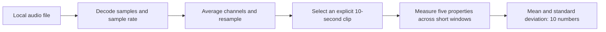

> Historical snapshot. For the current setup and file layout, see the [project README](../../README.md). Earlier raw experiment outputs are preserved in [the archive](../../data/archive/early_experiments.zip), using their original paths. Audio and plot links may refer to local-only files.

# Work debrief: building the foundations of an AI-music detector

**Snapshot: 19 September 2026, after feature extraction.**

This document explains what we have built, how it works, why we made the choices,
and what the evidence supports. It is a learning reference and source material
for a future article. It is not a final project report or a claim that we already
have a working detector.

## 1. What comes next

The next discussion should establish **which recordings are eligible and how we
will evaluate a classifier without leaking related music between datasets**.
The current six recordings are a development sample, not an evaluation dataset.

We should agree on these decisions before expanding the audio collection:

1. How to handle pending provenance/listening checks and the unusual Straw Fields
   waveform. We should document exclusions or corrections, rather than silently
   removing inconvenient examples after seeing model results.
2. How to group original references, generated counterparts, alternate versions,
   and shared human artists before assigning train, validation, and test sets.
3. Which generator, if feasible, to reserve for an additional unseen-generator test.
4. How to choose clips consistently and measure results at the original-track level.
5. Which metrics and comparisons will define a useful first experiment.

The training set will teach the classifier. Validation data will guide model and
threshold choices. A final test set will measure performance after the procedure
is fixed. The six clips we have already inspected should be treated as development
examples; they are not an untouched final test set.

After that protocol is agreed, we can propose a bounded dataset expansion and
implement the grouping/splitting checks. A scaling-plus-logistic-regression
baseline can follow. A frozen Hugging Face encoder experiment comes later, using
the same evaluation groups for a fair comparison.

These are proposed next steps, not changes implemented by this debrief. Each
implementation increment still requires your approval.

## 2. Where the project stands

The intended product accepts music and eventually reports likely AI-generated,
likely human-made, or inconclusive, with evidence-grounded explanations. Initial
scope is uploaded music and fully generated recordings versus credible human
references. Mixed production and microphone playback remain later work.

What works now is the preparation of model inputs:



Separately, metadata tools track the source recordings, licenses, artist IDs,
reference relationships, and unresolved issues.

| Capability | Current state |
|---|---|
| Load audio and show waveform/spectrogram | Implemented and exercised |
| Audit source metadata and candidate relationships | Implemented |
| Download six selected pilot recordings | Completed |
| Standardize a clip to mono, 24 kHz, ten seconds | Implemented and exercised |
| Extract ten named numerical features | Implemented and exercised |
| Train/validation/test assignment | Not implemented |
| Trained classifier and prediction thresholds | Not implemented |
| Accuracy, false-positive rate, calibration | Not evaluated |
| Hugging Face audio encoder | Not selected or loaded |
| Model-based explanation layer | Not implemented |
| Gradio interface or microphone workflow | Not implemented |

**The central distinction:** we can describe audio numerically. We cannot yet
infer whether a new recording is AI-generated.

## 3. The tools and why each exists

| Tool | Actual responsibility |
|---|---|
| Python | Processing logic, small command-line utilities, experiments and tests |
| NumPy | Sample arrays, numerical calculations, feature vectors |
| SoundFile | Decode audio into floating-point samples |
| Matplotlib | Plot waveforms and spectrograms for inspection |
| SciPy | Filtered resampling between sample rates |
| librosa | Standard implementations of the five audio features |
| pytest | Check behavior with known inputs and failure cases |
| uv | Manage the project environment and lock dependency versions |
| Python standard library | CSV/JSON metadata, ZIP reading, HTTP requests and hashes |

The recorded feature run used Python 3.12.10, NumPy 2.5.3, SciPy 1.18.1 and
librosa 0.11.0. Exact dependencies are in [uv.lock](../../uv.lock); direct requirements
are in [pyproject.toml](../../pyproject.toml). Scikit-learn is installed as a librosa
dependency, but no classifier has been used.

The verified development environment is Windows/PowerShell. A GTX 1660 Ti with
6 GB memory was detected; all completed work ran on the CPU. Python initially
failed under restricted execution but worked through the existing interpreter
outside that restriction. We did not need to install a new Python version.

Using existing scientific libraries lets us focus on contracts and experiments.
We still test their behavior in our pipeline: choosing a respected library does
not guarantee that we supplied the right shapes, units, or parameters.

## 4. First increment: understand audio as data

### What we built

[audio_inspection.py](../../audio_inspection.py) loads a local file, prints metadata,
and creates a waveform and spectrogram. You also reported successfully producing
a spectrogram from your own local file.

### How it works

SoundFile decodes samples as `float32` and always returns a channel dimension.
Mono therefore has shape `(frames, 1)`, while stereo has `(frames, 2)`. A frame
here means one simultaneous sample per channel, not a later analysis window.

For example, `(441000, 2)` at 44,100 Hz represents ten seconds of stereo audio:

```text
duration = number of sample frames / sample rate
         = 441000 / 44100
         = 10 seconds
```

Two channels do not double the duration. They provide two amplitude measurements
at each time position.

A waveform plots amplitude against time. A spectrogram shows frequency content
across successive short windows. Our inspection spectrogram uses a 1024-sample
Hann window and 50% overlap. The window reduces abrupt boundaries when computing
frequency content. Longer windows provide finer frequency detail but coarser
time localization.

Only channel 1 is plotted; all channels remain loaded. The color scale describes
power density in decibels, not calibrated sound pressure. A small power floor
avoids taking the logarithm of zero. Plot color limits are chosen separately, so
the same color in two figures is not necessarily the same power value.

### Why it mattered

Before choosing a model, we needed to understand its raw material and recognize
basic failures: missing files, empty audio, unreadable content, invalid values,
unexpected channels, and silence. Neither an unusual waveform nor a bright
spectrogram band establishes AI authorship.

Tests used generated tones and silence. Their frequencies and durations are
known in advance, so they make good checks of code behavior. They are not examples
for training a human-versus-AI classifier.

## 5. Second increment: investigate existing data instead of generating a corpus

You wanted to avoid the time required to build a large dataset from scratch.
We investigated existing sources and chose Echoes plus FMA small as candidates.

Echoes provides generated audio and reference metadata. FMA small provides
historical music excerpts with track and artist information. A common source
name did not guarantee that Echoes' references belonged to FMA's small subset,
so we checked the actual metadata before downloading audio.

The original sources and audited release information are linked in
[data/audit.md](audit.md), including the
[pinned Echoes release](https://huggingface.co/datasets/Octavian97/Echoes/tree/14b0c76c6a691c42fadfab9fb6a4eb1ee8c628a2)
and [FMA repository](https://github.com/mdeff/fma).

### What the metadata audit does

[dataset_audit.py](../../tools/dataset_audit.py) compares Echoes' reference strings with FMA
titles and artist names. It searches the full FMA metadata first, then checks
whether an unambiguous match belongs to the small subset.

Why that order? If two recordings have the same title and artist, selecting the
one in FMA small would hide the ambiguity. We retain all candidate IDs and flag
the reference instead. Conservative case/whitespace/Unicode normalization is
distinguished from exact matching. We do not automatically accept fuzzy matches.

An actual example is `1984 - Punk Rock Opera`, which matched two FMA IDs. It stayed
ambiguous. A name match is also not a fingerprint proving identical audio content.

### What we found

| Audit stage | Measured result |
|---|---:|
| Echoes manifest rows | 4,468 |
| Text-to-audio rows | 3,165 |
| Distinct reference strings | 296 |
| Ambiguous reference strings in FMA | 16 |
| Unambiguous references in FMA small | 119 |
| Associated text-generated rows | 1,389 |
| Provisional references after exclusions | 116 |
| Associated provisional text-generated rows | 1,342 |

We set aside three matched references carrying NoDerivatives license text, and
flagged repeated generated paths. That was a conservative selection decision,
not a finding that those license terms categorically prohibit model training.

The revised paper describes 300 references, while the CSV contains 296 distinct
reference strings. That is a discrepancy to investigate, not proof that four
files are missing: multiple recordings can share a title/artist string.

### How we kept downloads small

ZIP archives contain an index describing member locations. Our range reader
requested byte ranges for the index and selected CSV members. It refused servers
that responded with the entire archive instead of the requested range.

The first audit transferred 20.03 MiB of response bodies. A later raw-metadata
retrieval added 7.91 MiB. These figures exclude protocol overhead and package
downloads. They describe actual retrieval, not the total advertised dataset size.

ZIP CRC checks detect member corruption; SHA-256 receipts identify the retrieved
bytes. Hashes help reproduce and verify content. They do not prove authorship,
licensing, or that a label is correct.

## 6. Third increment: distinguish complete metadata from verified provenance

We retrieved FMA's original track metadata and created
[data/pilot_review.csv](../../data/preparation/pilot_review.csv), with one row per candidate human
reference and links to its generated counterparts.

The review retained source URLs, license URLs, artist IDs, reference IDs,
catalog-entry dates, recording dates where available, and reasons requiring review.

Of the 116 candidates, 109 had complete metadata under our implemented checks.
Seven used a legacy public-domain URL and remained flagged. The
[Creative Commons explanation](https://creativecommons.org/publicdomain/certification/1.0/us/)
identifies that older tool; we did not silently replace its terms with CC0.

All candidates still have `provenance_status=unverified`. That matters because:

```text
metadata_complete = required evidence fields are present and consistent
verified authorship = an evidence-backed judgment about the recording's origin
```

These are different questions. Historical catalog records are useful evidence,
but we have not independently reviewed the production history of every recording.
The original project aim of confirmed provenance therefore remains an eligibility
requirement to resolve before a credible evaluation.

Recording dates were missing for 111 of the 116 tracks. We kept catalog dates in
their own field instead of substituting them for recording dates.

### Why we collected group IDs

Imagine a human reference with twelve generated counterparts. Those are related
examples, not thirteen unrelated draws from the world. Likewise, two different
tracks by one artist may share production characteristics.

Group IDs allow a later split procedure to keep related examples together.
However, saving IDs does not itself prevent leakage. No split procedure exists
yet, and we must still audit duplicates and alternate encodings in a larger pool.

## 7. Fourth increment: download and inspect six actual recordings

Metadata cannot tell us whether the selected audio decodes correctly. We downloaded
three human-labeled FMA excerpts and three linked Echoes text-generated examples:

| Human reference | Generated counterpart |
|---|---|
| Straw Fields — Rolemusic | ACE-Step |
| Autopsy — Oh Yeah, the Future | Suno |
| Digital Lightning — Cloudkicker | Udio |

The word “counterpart” means linked through Echoes' reference metadata. It does
not mean a synchronized cover, identical composition, or corresponding timestamp.

[pilot_audio.py](../../tools/pilot_audio.py) restricts retrieval to six specific archive members,
checks expected sizes, preserves existing files, and writes integrity receipts.
The full pilot, including index reads, transferred 10.27 MiB under its 32 MiB cap.
Audio and generated plots are excluded from Git.

All six files decoded using the existing SoundFile installation. All durations
matched expectations within 0.25 seconds. Samples were finite, and no recording
was entirely zero. All six plots were visually inspected. Listening/content
identity checks remain pending in the records.

### The most useful discoveries

All three human excerpts were 44.1 kHz and approximately 30 seconds long. All
three generated examples were 48 kHz and longer, approximately 84–169 seconds.
One human excerpt was mono; the other files were stereo.

These differences are **confounds**: properties associated with the labels in
our collection that could give a misleading shortcut. A rule saying “48 kHz means
AI” would separate this tiny sample without learning a reliable property of
AI-generated music.

Straw Fields also had mean sample amplitude about -0.522756 across the decoded
excerpt and a visibly downward-shifted waveform. We documented the offset rather
than assuming its cause or repairing it automatically. Some other decoded peaks
exceeded magnitude 1; that observation alone does not diagnose audible clipping.

See [data/audio_pilot_report.md](audio_pilot_report.md) for audio/plot links,
and [data/audio_pilot_results.json](../../data/preparation/audio_pilot_results.json) for measurements.

## 8. Fifth increment: define one preprocessing contract

The purpose of preprocessing is to give downstream code a consistent input
representation. We implemented this explicit contract in
[preprocessing.py](../../preprocessing.py):

```text
Input:  floating samples shaped (frames, 1 or 2), original sample rate,
        and a required start time
Output: float32 array shaped (240000,), mono, 24000 Hz, exactly 10 seconds
```

### Step A: average channels

For stereo, each output sample is `(left + right) / 2`. In code, `mean(axis=1)`
averages the channel dimension and retains time. This is simple and consistent,
but opposing stereo signals can cancel. That trade-off is documented and tested.

### Step B: resample with filtering

Resampling estimates the signal on a new time grid. Merely changing a sample-rate
label would change playback speed and pitch. The implemented SciPy operation
filters as part of resampling to reduce high-frequency aliasing.

For 44,100 to 24,000 Hz, the reduced ratio is `80/147`. For 48,000 to 24,000 Hz,
it is `1/2`. At 24 kHz, frequencies above the 12 kHz Nyquist limit cannot be
represented. This means standardization also discards potentially useful detail;
24 kHz is a provisional baseline setting, not a chosen encoder's requirement.

The filter uses an explicit Kaiser window with beta 5.0 and zero extension at the
recording boundaries. That boundary assumption can cause edge effects. See the
[SciPy method documentation](https://docs.scipy.org/doc/scipy/reference/generated/scipy.signal.resample_poly.html).

### Step C: take the requested ten seconds

The caller specifies the start; it rounds down to the target sample grid by less
than 1/24000 second. The function resamples the whole recording before slicing.
It rejects audio too short for the requested interval instead of padding it to
make a valid clip. This straightforward design holds the recording in memory.

All six smoke checks used `start_seconds=0.0`. That was an explicit testing choice,
not a finalized training policy. Beginning-of-file clips may capture intros or
silence, and choosing different positions for each class could create another bias.

All six outputs satisfied the contract, with original files and arrays unchanged.
We did not normalize volume, remove offsets, or fit any learned transformation.
Matching shape/rate does not erase earlier compression or collection differences.

## 9. Sixth increment: turn each clip into ten measurements

[features.py](../../features.py) measures five properties across short analysis windows,
then summarizes their mean and population standard deviation.

| Property | Meaning | Caution |
|---|---|---|
| RMS | Typical sample-amplitude magnitude within a window | Not perceptual loudness; offsets contribute |
| Zero-crossing rate | How often the signal changes sign | Changes with frequency content and offsets |
| Spectral centroid | Magnitude-weighted center frequency | Not an AI-specific signature |
| Spectral bandwidth | Magnitude-weighted spread around the centroid | Not the file's sample rate or codec bitrate |
| Spectral flatness | How evenly power is distributed across frequency bins | Numerical floors affect silence/quiet windows |

Mean captures the average measurement. Standard deviation captures how much it
varies across windows. Five properties multiplied by two summaries gives ten
numbers. These standard deviations are not confidence estimates about authorship.

### The shapes, step by step

The feature extractor uses 1024-sample windows and a 512-sample hop, with no edge
padding. At 24 kHz, that is a 42.667 ms window every 21.333 ms.

```text
One clip                         (240000,)
Magnitude spectrogram            (513, 467)
Five feature sequences           (5, 467)
Mean and std for each feature    (5, 2)
Flattened feature vector         (10,)
Six pilot feature vectors        (6, 10)
```

The 513 bins come from a 1024-point transform of real audio: `1024/2 + 1`.
There are 467 complete windows. The final 384 samples, or 16 ms, do not fit another
full window and are omitted. RMS/zero crossings use unwindowed samples; spectral
measurements use a Hann window. Details are explicit in the code and
[recorded configuration](../../data/archive/early_experiments.zip).

The output order is RMS mean/std, zero-crossing mean/std, centroid mean/std,
bandwidth mean/std, then flatness mean/std. `FEATURE_NAMES` exposes that order so
future training and inference can use exactly the same columns.

One subtle result: silence has zero RMS, zero crossings, centroid and bandwidth,
but flatness 1. Librosa floors power before taking logarithms; equal floored bins
produce that value. It is not evidence that silence is noise. The implementation
and tests document this convention. See the
[librosa feature definitions](https://librosa.org/doc/0.11.0/_modules/librosa/feature/spectral.html).

Mean/std discard temporal order. Two clips with different musical structure can
have similar summaries. This is a deliberately simple baseline representation,
whose usefulness remains an experimental question.

## 10. Trace one real file through everything

Take `data/audio_pilot/human_112315.mp3`, the Digital Lightning excerpt.

1. `load_audio()` returns shape `(1323119, 2)` at 44,100 Hz.
2. Its duration is `1323119 / 44100`, approximately 30.003 seconds.
3. Averaging channels gives one signal of shape `(1323119,)`.
4. Resampling and selecting from second zero gives `(240000,)` at 24 kHz.
5. The extractor measures five properties across 467 windows.
6. The resulting ten numbers include RMS mean **0.275001**, RMS std **0.060915**,
   centroid mean **2376.946 Hz**, and flatness mean **0.031269**.

These are actual saved results, rounded for readability. The mean of short-window
RMS values need not equal RMS calculated once over the entire clip; they aggregate
the samples differently.

Try the current pipeline in the project's Python interpreter:

```python
from audio_inspection import load_audio
from preprocessing import preprocess_audio
from features import extract_features, FEATURE_NAMES

audio = load_audio("data/audio_pilot/human_112315.mp3")
clip = preprocess_audio(audio, start_seconds=0.0)
vector = extract_features(clip)

print(audio.samples.shape, audio.sample_rate)
print(clip.shape, vector.shape)
for name, value in zip(FEATURE_NAMES, vector):
    print(f"{name}: {value:.6f}")
```

The function returns measurements only. No prediction happens after this code.

## 11. What testing established

The latest recorded full execution was **86 passed**, with one existing warning
from the one-sample spectrogram fixture. The suite was not rerun solely for this
documentation change; this is the verified result from the preceding increment.

| Increment | Recorded full-suite total after implementation |
|---|---:|
| Audio inspection | 11 |
| Metadata audit | 26 |
| Pilot review manifest | 39 |
| Six-file audio inspection | 46 |
| Preprocessing | 74 |
| Feature extraction | 86 |

We wrote behavioral tests before production implementations. Initial tests often
failed during import because the module/function did not yet exist. Later checks
also caught missing diagnostics and incorrect legacy-license/version handling.
Those failures are useful evidence of development work, not failed ML experiments.

Examples of meaningful signal checks include preserving a known tone's frequency,
filtering an 18 kHz signal before downsampling to 24 kHz, measuring higher RMS for
a louder tone, and obtaining broader/flatter spectra for noise than for a tone.
Tests also cover malformed input, ambiguous metadata, transfer limits, overwrite
refusal, and unchanged source arrays/files.

**Tests establish implementation behavior. Held-out experiments establish model
usefulness. Neither substitutes for the other.**

There is no detector accuracy, precision, recall, calibration, unseen-generator
result, or microphone robustness measurement yet.

## 12. Findings and limitations worth remembering

| Observation | Engineering lesson |
|---|---|
| Metadata had ambiguous names and repeated paths | Labels and identifiers need inspection before training |
| Catalog dates differed from missing recording dates | Similar-looking metadata fields are not interchangeable |
| Human/AI pilot files differed in rate and duration | A model can learn collection shortcuts |
| Straw Fields had a large offset | A decodable file can still be an unsuitable training example |
| Silence had flatness 1 | Numerical definitions need interpretation and tests |
| Mean RMS separated our three-versus-three sample | Tiny observations do not establish generalization |

All three human-labeled clips have higher mean RMS than the three generated clips
in [the saved table](../../data/archive/early_experiments.zip). We must not turn that into an
“AI fingerprint” claim. Mastering, intro selection, the offset, or source choices
may account for the pattern. We have not tested those explanations.

The provisional candidate pool is also imbalanced: many generated rows relate
to relatively few human references. More generated variants do not create more
independent human examples. Future results need track-level aggregation and
group-aware evaluation rather than treating correlated clips as independent.

Other pending matters include actual provenance/listening review, duplicate audio
under different filenames, genre balance, codec history, unfamiliar generators,
and deciding whether/when to correct offsets or normalize amplitude.

## 13. A map of the files

| File | Where to look and why |
|---|---|
| [audio_inspection.py](../../audio_inspection.py) | Decoding, the Audio container, metadata and plots |
| [dataset_audit.py](../../tools/dataset_audit.py) | Bounded metadata access, matching and candidate review |
| [pilot_audio.py](../../tools/pilot_audio.py) | Six-file download allowlist and audio sanity checks |
| [preprocessing.py](../../preprocessing.py) | Shared mono/rate/duration contract |
| [features.py](../../features.py) | Five frame measurements and ten ordered summaries |
| [tests/](../../tests) | Expected behavior and regression cases |
| [journal.md](../journal.md) | Increment-by-increment decisions and execution history |
| [data/audit.md](audit.md) | Dataset counts, source evidence and unresolved metadata |
| [data/pilot_review.csv](../../data/preparation/pilot_review.csv) | Candidate references, evidence and review flags |
| [data/audio_pilot_manifest.csv](../../data/preparation/audio_pilot_manifest.csv) | Six selected members and their source expectations |
| [data/audio_pilot_report.md](audio_pilot_report.md) | Audio properties, issues and plot links |
| [data/preprocessing_pilot_results.json](../../data/archive/early_experiments.zip) | Actual preprocessing outputs and checks |
| [data/pilot_features.csv](../../data/archive/early_experiments.zip) | Six rows with ten measurements plus metadata |
| [data/pilot_features_config.json](../../data/archive/early_experiments.zip) | Versions, settings, feature order and hashes |
| [pyproject.toml](../../pyproject.toml) / [uv.lock](../../uv.lock) | Declared dependencies and resolved versions |

The feature CSV also contains labels, IDs, generator names and review notes.
Those are metadata, not feature columns. Passing all CSV columns blindly into a
classifier could disclose labels or source identity directly.

Downloaded metadata/audio and plot PNGs are ignored by Git. A repository checkout
alone therefore does not contain every local artifact. Source receipts and
download utilities help reconstruct them within an approved download scope.

## 14. Commands and exercises you can use now

Run commands from the project folder in PowerShell:

```powershell
# Check installed code behavior:
.\.venv\Scripts\python.exe -m pytest -q

# Open an interactive waveform and spectrogram:
.\.venv\Scripts\python.exe audio_inspection.py data/audio_pilot/human_112315.mp3

# Regenerate the local six-file audio measurements and PNGs:
.\.venv\Scripts\python.exe pilot_audio.py inspect

# Start Python, then use the example from section 10:
.\.venv\Scripts\python.exe
```

In a fresh environment, `uv sync --locked` installs the recorded dependencies
and may download packages. Reading the existing local audio requires no network.

Three exercises connect the code to the concepts:

1. Change a clip's start from 0 to 5 seconds. Its contents should change while its
   shape remains `(240000,)`. A start of 25 seconds on a 30-second file should fail.
2. Compare `extract_features(clip)` with `extract_features(clip * 0.5)`. RMS mean/std
   should approximately halve. Normalized spectral measurements should remain
   similar, except where numerical floors affect quiet content.
3. Explain why an offset can increase RMS even without making a signal more
   musically complex. Connect your answer to the constant-offset feature test.

## 15. Turning this work into an article later

### A suitable narrative

A useful article can ask: **Can simple audio measurements detect generated music,
or do they mostly reveal how the dataset was assembled?** That is a research
question at this stage, not a result we have already established.

Build the narrative around decisions and evidence:

1. Explain the task and why generation detection differs from song identification.
2. Describe the initial scope and why provenance/uncertainty matter.
3. Show one waveform and spectrogram to explain the raw input.
4. Describe the dataset audit and one real ambiguous reference or repeated path.
5. Show the sample-rate/duration confound and why preprocessing became necessary.
6. Trace one file through the actual array shapes into its feature vector.
7. Later, present a fixed evaluation protocol, baseline results and representative errors.
8. Later, compare a frozen Hugging Face encoder fairly with the baseline.
9. Discuss false positives, unseen generators, limitations and what failed.
10. End with what the experiments support and the next unanswered question.

Steps 7–10 need future experimental evidence. Leave them explicitly unfinished
instead of drafting plausible-looking scores or conclusions now.

### Claims supported now

- Built a tested Python pipeline for loading, inspecting, standardizing and
  extracting descriptive features from music audio.
- Audited an Echoes/FMA candidate pool and documented ambiguous references,
  duplicate paths and licensing/provenance questions.
- Used selective archive reads to retrieve a six-file pilot.
- Produced ten finite features per clip and recorded reproducible settings.
- Observed collection confounds and an unusual waveform offset in the pilot.
- Recorded 86 passing tests at the latest implementation milestone.

### Claims not supported now

- Detects AI-generated music accurately or reliably.
- Generalizes to unseen generators or microphone recordings.
- Explains a prediction with verified forensic evidence.
- Uses Hugging Face embeddings for detection: so far Hugging Face hosts one data source.
- Trained or evaluated on all 116 candidate references: only six audio files were processed.
- Independently verified every human label or cleared public redistribution.

Save confusion matrices, class counts, fixed split/group identifiers, experiment
settings, errors, calibration checks and representative audio examples when those
experiments are approved and run. Distinguish an influential feature from a causal
explanation or proof of provenance. A future model score is not automatically a
calibrated probability.

Credit the dataset authors, libraries and any future pretrained encoder. Also
describe AI assistance honestly: Codex helped research, implement, test and document
approved increments, while your role includes choosing the scope, questioning
decisions, reviewing the work and developing the ability to explain it. Publication,
audio redistribution and public hosting remain separate approval steps.

## 16. Questions you should eventually answer without looking at the code

1. What does each dimension of the loaded audio array represent?
2. Why do changing a rate label and resampling produce different outcomes?
3. What information do mono conversion, filtering and mean/std summaries discard?
4. How do we get from 240,000 samples to ten feature values?
5. Why is metadata completeness weaker than verified human provenance?
6. How could a random clip split leak related music across training and testing?
7. Why would a high score on this six-record pilot be unconvincing?
8. What did tests actually verify, and which questions require experiments?
9. Which measurements can we explain today, and which provenance claims remain unsupported?
10. What evidence would change your mind if the eventual classifier performed well?

The project is currently a tested foundation for experiments. Its next important
result should come from a credible evaluation design, not from rushing to a score.
